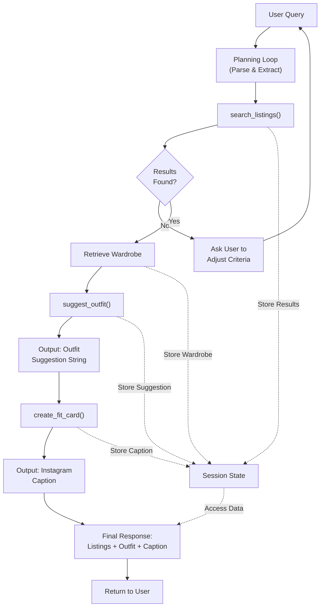

# FitFindr — Starter Kit

## Tools

List every tool your agent will use. For each tool, fill in all four fields.
You must have at least 3 tools. The three required tools are listed — add any additional tools below them.

### Tool 1: search_listings

**What it does:**
Searches a database of clothing listings based on the provided description, size, and price constraints. Returns the 3 most relevant matching listings sorted by relevance to the user's search criteria. If matches are found, the results are passed to suggest_outfit() to create outfit combinations with items already in the user's wardrobe.

**Input parameters:**
- `description` (str): A text query describing the clothing item to search for (e.g., "vintage graphic tee", "black leather jacket"), used to match against listing titles and details
- `size` (str): The clothing size to filter results by (e.g., "S", "M", "L", "XL")
- `max_price` (float): The maximum price threshold in dollars; only listings at or below this price are returned

**What it returns:**
A list of up to 3 listing objects, each containing: `id` (unique identifier), `title` (item name), `price` (float), `size` (str), `color` (str), `condition` (str, e.g., "new" or "gently used"), `description` (item details), and `image_url` (link to product image).

**What happens if it fails or returns nothing:**
If no listings match the search criteria, the agent should ask the user to relax their constraints and offer to search again with the adjusted parameters.

---

### Tool 2: suggest_outfit

**What it does:**
Takes a newly found clothing item and matches it with pieces from the user's existing wardrobe to generate complete outfit combinations. Returns multiple outfit suggestions that style the new item with complementary existing pieces.

**Input parameters:**
- `new_item` (dict): A listing dict from search_listings with fields: `id`, `title`, `description`, `category`, `style_tags` (list), `size`, `condition`, `price`, `colors` (list), `brand`, `platform`
- `wardrobe` (dict): A wardrobe dict with an `items` key containing a list of wardrobe item dicts (may be empty)

**What it returns:**
A non-empty string with outfit suggestions. If the wardrobe contains items, return 1–2 complete outfit combinations pairing the new item with specific wardrobe pieces. If the wardrobe is empty, return general styling advice for the item (e.g., what kinds of pieces pair well with it, what vibe it suits).

**What happens if it fails or returns nothing:**
Never returns empty or None. If the wardrobe is empty, gracefully handle by offering general styling advice instead of raising an exception.

---

### Tool 3: create_fit_card

**What it does:**
Generates a short, casual, shareable outfit caption for the thrifted item suitable for Instagram or TikTok. The caption should feel like an authentic OOTD post and naturally mention the item name, price, and platform.

**Input parameters:**
- `outfit` (str): The outfit suggestion string from suggest_outfit()
- `new_item` (dict): The listing dict for the thrifted item (contains title, price, platform, etc.)

**What it returns:**
A 2–4 sentence string formatted as an Instagram/TikTok caption that mentions the item name, price, and platform once each, captures the outfit vibe in specific terms, sounds natural and casual (not like a product description), and varies each time it's called for different inputs.

**What happens if it fails or returns nothing:**
If the outfit string is empty or missing, return a descriptive error message string instead of raising an exception. Always return a non-empty string.

---

<!-- ### Additional Tools (if any) -->

<!-- Copy the block above for any tools beyond the required three -->

---

## Planning Loop

**How does your agent decide which tool to call next?**

The agent follows a linear sequence:

1. **First tool (search_listings):** Always called first. The agent parses the user's query to extract item description, size (if mentioned), and price constraints. If search_listings returns results, proceed to step 2. If no results, ask the user to adjust their criteria and offer to search again.

2. **Second tool (suggest_outfit):** Called only if search_listings returns results. The agent retrieves the user's wardrobe and calls suggest_outfit with the best match and wardrobe data. This always returns a non-empty string (either specific outfit combinations or general styling advice).

3. **Third tool (create_fit_card):** Called after suggest_outfit completes. The agent passes the outfit suggestion and the item listing to generate a shareable caption.

4. **Done:** After create_fit_card returns, the agent compiles the final response showing all search results, outfit suggestions, and the fit card caption.

The agent never backtracks—each tool is called at most once per user query, in order. The only decision branch is at step 1: if search returns nothing, ask the user to refine their search rather than proceeding to the next tools.

---

## State Management

**How does information from one tool get passed to the next?**

The agent maintains session state across tool calls:

1. **User query parsing:** The agent extracts and stores the user's original query, parameters (description, size, max_price) for use in search_listings.

2. **search_listings output:** The search results (list of 3 listings) are stored in session state. The best match listing is selected and retained for downstream tools.

3. **Wardrobe retrieval:** The user's wardrobe is fetched once and stored in session state at the beginning of the interaction (after search_listings confirms results exist).

4. **suggest_outfit → create_fit_card:** The outfit suggestion string returned by suggest_outfit is stored and passed directly to create_fit_card, along with the best-match listing from step 2.

5. **Final compilation:** At the end, the agent compiles and returns all stored state: the full search results list, outfit suggestions, and the fit card caption.

All state is session-scoped (lives for one user query). No permanent storage between sessions is needed.

---

## Error Handling

For each tool, describe the specific failure mode you're handling and what the agent does in response.

| Tool | Failure mode | Agent response |
|------|-------------|----------------|
| search_listings | No results match the query | Ask the user to relax their constraints (increase price, expand size range, broaden item description) and offer to search again with adjusted parameters. |
| suggest_outfit | Wardrobe is empty | Gracefully return general styling advice for the item (what kinds of pieces pair well, what vibe it suits) instead of raising an exception. |
| create_fit_card | Outfit input is missing or incomplete | Return a descriptive error message string (e.g., "Could not generate caption due to incomplete outfit data") instead of raising an exception. Always return a non-empty string. |

---

## Architecture

**Component flow:**
- **User Input:** The query is parsed to extract item description, size, and price constraints
- **Planning Loop:** Manages the sequential execution of tools and decision logic
- **Tools:** Three sequential tools (search_listings → suggest_outfit → create_fit_card)
- **State/Session:** Stores search results, wardrobe data, outfit suggestions, and captions—all shared between tools
- **Error path:** If search returns no results, the agent loops back to ask the user to refine their search
- **Final output:** Aggregates results from all three tools into a single response

---

## AI Tool Plan

<!-- For each part of the implementation below, describe:
     - Which AI tool you plan to use (Claude, Copilot, ChatGPT, etc.)
     - What you'll give it as input (which sections of this planning.md, your agent diagram)
     - What you expect it to produce
     - How you'll verify the output matches your spec before moving on

     "I'll use AI to help me code" is not a plan.
     "I'll give Claude my Tool 1 spec (inputs, return value, failure mode) and ask it to implement
     search_listings() using load_listings() from the data loader — then test it against 3 queries
     before trusting it" is a plan. -->

**Milestone 3 — Individual tool implementations:**

For search_listings, I'll give Claude the Tool 1 block from planning.md (inputs, return value, failure mode) and ask it to implement the function using load_listings() from the data loader. Before running it, I'll check that the generated code filters by all three parameters, scores by keyword relevance, and handles the empty-results case. Then I'll test it with 3 queries: a specific search with all constraints, a search with partial constraints, and a query that returns no matches.

For suggest_outfit, I'll give Claude the Tool 2 block and explain that it should call the Groq LLM (via _get_groq_client()) with a formatted prompt containing the new item and wardrobe items. I'll verify the code checks for an empty wardrobe and returns general styling advice in that case, then test it with a populated wardrobe and again with an empty wardrobe.

For create_fit_card, I'll give Claude the Tool 3 block and note that the LLM should use higher temperature for caption variety. I'll check that the generated caption is 2–4 sentences, mentions item name/price/platform exactly once each, and handles empty outfit input gracefully. I'll run it multiple times with the same input to verify captions vary.

**Milestone 4 — Planning loop and state management:**

I'll give Claude the full planning.md spec, the Architecture diagram, and the three implemented tools, then ask it to build agent.py with a main loop that parses the user query, calls search_listings, checks for results (asking the user to refine if none), retrieves the wardrobe, calls suggest_outfit, then create_fit_card, and finally compiles all outputs. I'll test end-to-end with the example query from planning.md, verify the agent outputs search results, outfit suggestions, and a fit card caption in the correct order, and test the error path where search returns no results.

---

## A Complete Interaction (Step by Step)

**Example user query:** "I'm looking for a vintage graphic tee under $30. I mostly wear baggy jeans and chunky sneakers. What's out there and how would I style it?"

**Step 1:**
The agent calls `search_listings(description="vintage graphic tee", size=None, max_price=30)`.
Returns 3 matching listings, e.g.: a 90s band tee ($18), a retro sports graphic ($25), a vintage Nirvana tee ($28).

**Step 2:**
The agent retrieves the user's wardrobe (baggy jeans, chunky sneakers, etc.) and calls `suggest_outfit(new_item=best_match_listing, wardrobe=user_wardrobe)`.
Returns outfit suggestions, e.g.: "Pair the vintage tee with your baggy jeans and chunky white sneakers for a 90s streetwear vibe. Add a oversized denim jacket for an extra layer."

**Step 3:**
The agent calls `create_fit_card(outfit=outfit_suggestion_string, new_item=best_match_listing)`.
Returns a casual Instagram caption, e.g.: "Scored this iconic vintage graphic tee for $18 on Depop and it pairs perfectly with my baggy jeans. 90s nostalgia hits different 🖤 #thriftflip"

**Final output to user:**
The agent shows the user:
1. The 3 matching listings with images, prices, and descriptions
2. The suggested outfit combinations
3. A shareable fit card caption for the item they're most interested in
